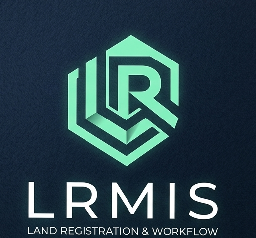
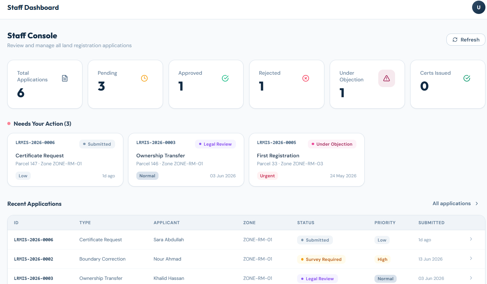
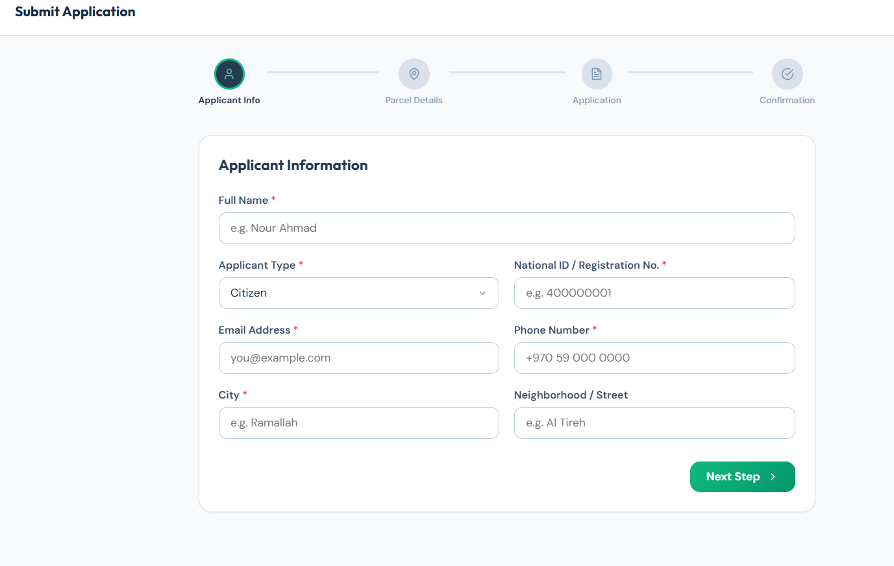
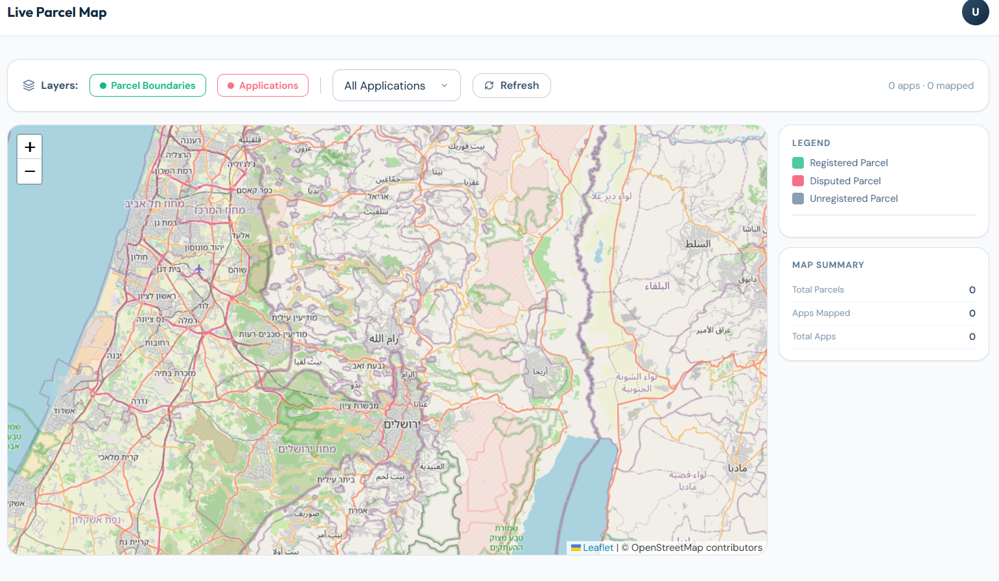

<p align="center">
  
</p>

<h1 align="center">🗺️ LRMIS – Land Registration Management Information System</h1>

<p align="center">
  A full workflow-driven, geospatial land registration platform built for managing land parcels, applications, surveys, and certificates.
</p>

<p align="center">
  
  
  
  
  
  
</p>

---

## 📘 Overview

LRMIS is a full-stack land registration platform that digitises the entire workflow of land ownership applications — from submission to certificate issuance.  
It combines a **FastAPI backend**, a **MongoDB** database with geospatial indexing, and a **React** frontend with an interactive **Leaflet map**.

---

## 🚀 Features

### ✔ Application Workflow Engine
- Full state machine: `submitted → pre_checked → survey_required → surveyed → legal_review → approved → certificate_issued → closed`
- Alternative states: `rejected`, `on_hold`, `missing_documents`, `under_objection`
- Enforced transition rules (e.g. ownership deed must be uploaded before legal review)
- Full audit trail logged for every transition

### ✔ Parcel Management
- GeoJSON geometry storage with 2dsphere indexing
- Live interactive map with parcel overlays (Leaflet + OpenStreetMap)
- Pending applications heatmap

### ✔ Survey Management
- Auto-assign surveyors based on zone and workload
- Survey milestone tracking
- Report upload and metadata storage

### ✔ Document & Objection Handling
- Upload document metadata per application
- File and view objections against applications
- Full comment thread per application

### ✔ Certificate Issuance
- Generate land registration certificates on approved applications
- Certificate records stored with unique IDs

### ✔ Analytics Dashboard
- KPI overview (processing time, volume, status breakdown)
- Applications grouped by status, zone, and type
- Surveyor workload breakdown
- GeoJSON feeds for map analytics

### ✔ Role-Based Views
- Separate dashboards for applicants and staff
- 4-step application submission flow for applicants
- Application management table for staff

---

## 🧰 Tech Stack

| Component | Technology | Purpose |
| :--- | :--- | :--- |
| **FastAPI** | Python 3.11+ | REST API framework |
| **Motor** | Async MongoDB driver | Non-blocking DB operations |
| **MongoDB** | Database | Collections + 2dsphere geospatial indexes |
| **Pydantic v2** | Schema validation | Request / response models |
| **Uvicorn** | ASGI server | Runs the FastAPI app |
| **React 18** | Frontend UI | All pages and components |
| **React Router v6** | Frontend routing | Client-side navigation |
| **Axios** | HTTP client | API communication |
| **React Leaflet** | Maps | Interactive parcel map |
| **Recharts** | Charts | Analytics visualisations |
| **Vite** | Build tool | Frontend dev server |

---

## 📁 Project Structure


```

lrmis/
│
├── backend/
│   ├── app/
│   │   ├── core/           # Config, database connection, indexes
│   │   ├── routers/        # FastAPI route handlers
│   │   ├── schemas/        # Pydantic validation models
│   │   ├── services/       # Business logic layer
│   │   └── utils/          # Helpers (serialization, ID generation)
│   ├── requirements.txt
│   └── .env.example
│
└── frontend/
├── src/
│   ├── components/     # UI components, layout, map
│   ├── lib/            # API client, utilities
│   └── pages/          # All page components
└── package.json

```

---

## 📸 Screenshots

| Screen | Preview |
| :--- | :--- |
| **Staff Dashboard** |  |
| **Submit Application** |  |
| **Parcel Map** |  |
| **Application Details** |  |

---

## ⚙️ Installation

### 1️⃣ Clone the Repository
```bash
git clone https://github.com/abdallahabed/lrmis.git

```

### 2️⃣ Backend Setup

```bash
cd backend
# Copy and configure environment
cp .env.example .env
# Install dependencies
pip install -r requirements.txt
# Start the server
uvicorn app.main:app --reload --port 8000

```

### 3️⃣ Frontend Setup

```bash
cd frontend
npm install --legacy-peer-deps
npm run dev

```

---

## 🧠 How It Works

* **Workflow engine** enforces transition rules — illegal state jumps are rejected by the backend.
* **MongoDB 2dsphere index** on parcel geometry enables geospatial queries and the live map feed.
* **Audit log** in `performance_logs` is append-only — every transition is recorded with actor and timestamp.

---

## 🔄 Workflow State Machine

`submitted → pre_checked → survey_required → surveyed → legal_review → approved → certificate_issued → closed`

---

## 👨‍💻 Developer

**Abdallah Aabed** Computer Science Student – Birzeit University

---

## 📜 License

This project is licensed under the **MIT License**.

---

*COMP4382 — Computer Science Department — Birzeit University — 2025–2026*

